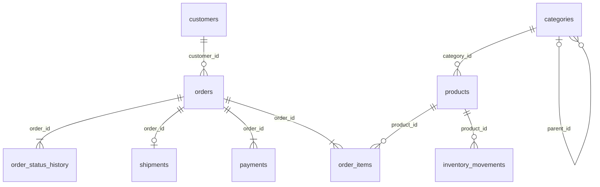

# MiniCommerce schema map

Sözleşme: `MINICOMMERCE_DATASET_SPEC.md`. PostgreSQL 17, public schema, dokuz tablo.

Diagramdaki en az bir item/payment/history şartı başlangıç dataset'inin
invariant'ıdır; SQL FK tek başına parent'ın en az bir child'ı olmasını zorlamaz.
Her order'ın sıralı geçmişi vardır. Shipment en fazla birdir; hiç olmayabilir.
Kategori ağacı dört köklü ve en derin dalı dört seviyelidir.

Tüm `id` alanları bigint PK ve `GENERATED BY DEFAULT AS IDENTITY` kullanır.
Seed sonrası sequence'ler `max(id)` değerine ayarlanır. FK'ler varsayılan
`NO ACTION`, immediate davranışındadır; örtük cascade silme yoktur.
E-posta birebir/case-sensitive unique'dir; seed adresleri lowercase'dir.
`order_items(order_id, product_id)` bilinçli olarak unique değildir: aynı ürün
bir siparişte farklı tarihsel fiyatlarla ayrı satırlarda bulunabilir.

Kontroller: boş olmayan isim/e-posta/provider; pozitif item quantity;
sonlu, sıfır veya pozitif fiyat/tutar; order/payment/shipment/history status
kümeleri; shipment durumuna uygun NULL ve tarih sırası; sıfır olmayan inventory
delta ve reason/işaret uyumu. Kategori kendi parent'ı olamaz. Birden fazla düğümlü
kategori döngüsü, order/history/payment arasındaki zaman ilişkileri ve dataset
edge case'leri verification'da ayrıca kontrol edilir; cross-table trigger yoktur.

## Index listesi

Tümü B-tree; dokuz PK index'i ve iki UNIQUE index'i otomatik oluşur.

| Index | Kolonlar | Gerekçe |
|---|---|---|
| `customers_pkey` … diğer sekiz `*_pkey` | `id` | Kimlik erişimi ve FK hedefi |
| `customers_email_key` | `email` | Tekil müşteri e-postası ve lookup |
| `shipments_order_key` | `order_id` | Order başına en fazla bir shipment, FK erişimi |
| `categories_parent_idx` | `parent_id` | Kategori ağacında child bulma |
| `products_category_idx` | `category_id` | Kategori ürünleri ve FK |
| `orders_customer_created_id_idx` | `customer_id, created_at, id` | Müşteri siparişleri, tarih ve pagination tie-breaker |
| `order_items_order_idx` | `order_id` | Sipariş satırları |
| `order_items_product_idx` | `product_id` | Ürün satışları, unsold kontrolü |
| `payments_order_created_id_idx` | `order_id, created_at, id` | Payment attempt sırası |
| `order_status_history_order_changed_id_idx` | `order_id, changed_at, id` | Son status ve sıralı geçmiş |
| `inventory_movements_product_created_id_idx` | `product_id, created_at, id` | Ürün ledger'ı ve running balance sırası |

Toplam 19 index. Tüm FK'ler bir index'in ilk kolonu olarak kapsanır.
Performance çalışmaları için global `orders(created_at, id)`, `orders(status, created_at)`,
payment provider/status/amount, product name araması ve covering/partial index'ler
başlangıçta yoktur. Müşteri index'i global tarih filtresini tam karşılamaz.
Veri dağılımı uniform değildir; yükleme/restore sonrası `ANALYZE` çalışır.
